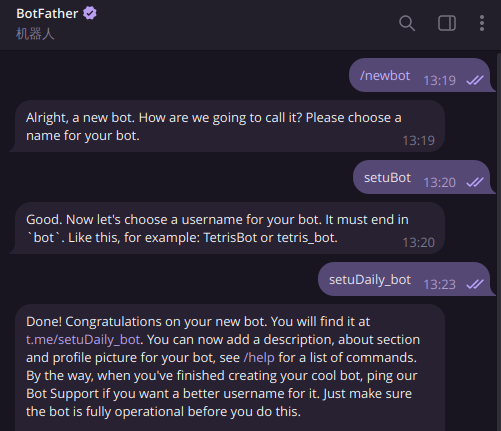
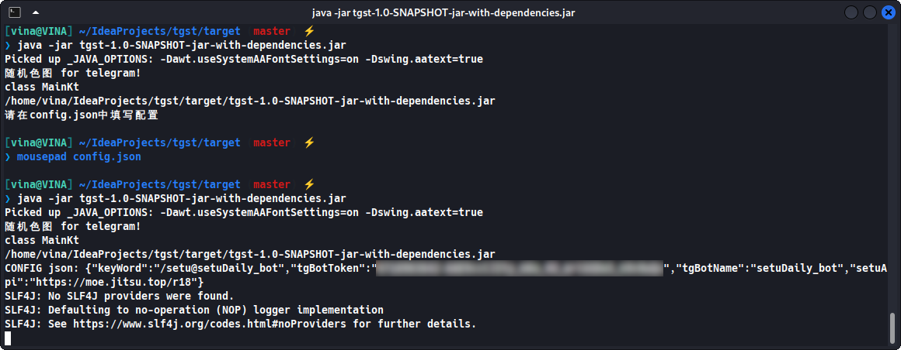

# tgsetu
[Telegram的色图机器人](https://t.me/setuDaily_bot)  

# 开始使用前
<b>安装java</b>  

+ ubuntu: `sudo apt install openjdk-17-jdk`  
+ windows: 前往[oracle](https://www.oracle.com/java/technologies/downloads/#jdk17-windows)手动下载安装  

<b>申请tg机器人</b>

+ 添加 https://t.me/BotFather 为好友  
+ 如图所示即可创建机器人  



# 快速安装
1. [下载jar文件](https://github.com/xmexg/tgsetu/releases)  
2. cd到jar文件所在目录,使用 `java -jar 文件名.jar` 运行  
3. 初次运行会生成 `config.json` 配置文件,编辑该json文件并再次运行jar


# 从源码构建
+ ## 克隆项目
    `git clone https://github.com/xmexg/tgsetu.git`  
    `cd tgsetu`
+ ## 安装 `jdk17`
    + <b>ubuntu</b>: `sudo apt install openjdk-17-jdk`  
    + <b>windows</b>: 前往[oracle](https://www.oracle.com/java/technologies/downloads/#jdk17-windows)手动下载安装
+ ## 安装 `mvn`  
    + <b>ubuntu</b>: `sudo apt install maven`  
    + <b>windows</b>:  
        - 手动安装: 在[官网](https://maven.apache.org/download.cgi)下载并配置环境变量   
        - 命令安装:  
                1. `使用win + r`输入`powershell`打开终端  
                2. 依次执行  
                    `Set-ExecutionPolicy Bypass -Scope Process -Force`   
                    `iwr https://chocolatey.org/install.ps1 -UseBasicParsing | iex`   
                    `choco install maven`  
                    完成安装
+ ## 开始构建
    `mvn clean package`
    ```
    [INFO] ------------------------------------------------------------------------
    [INFO] BUILD SUCCESS
    [INFO] ------------------------------------------------------------------------
    [INFO] Total time:  14.407 s
    [INFO] Finished at: 2023-12-17T17:08:57+08:00
    [INFO] ------------------------------------------------------------------------
    ```

+ ## 运行jar
    + `cd target`  
    + `java -Dhttp.proxyHost=127.0.0.1 -Dhttp.proxyPost=(你的代理端口) -jar tgst-1.0-SNAPSHOT-jar-with-dependencies.jar`  
	国内不能连接到telegram, 有如下两种方法:  
		1. 你尝试添加 `-Dhttp.proxyHost=127.0.0.1 -Dhttp.proxyPost=(你的http代理端口)` 设置代理
		```
		java -Dhttp.proxyHost=127.0.0.1 -Dhttp.proxyPost=20171 -jar tgst-2.0-SNAPSHOT-jar-with-dependencies.jar
		```  
		2. 在国外服务器运行该程序  
		推荐第二种方法, 因为第一种方法不稳定, 即便设置代理,有时也会意外断开连接  


# config.json配置文件
``` 
    {
	"tgBotName": "",
	"tgBotToken": "",
	"message": [
		{
			"type": "help",
			"keyWord": ["help", "/help", "start", "/start", "帮助", "/帮助"],
			"intro": "色图机器人 for telegram, 仓库地址: https://github.com/xmexg/tgsetu"
		},
		{
			"type": "image",
			"keyWord": ["/hentai", "hentai", "/setu", "setu", "色图", "涩图", "来点色图", "来点涩图", "来张色图", "来张涩图"],
			"url": "https://moe.jitsu.top/r18",
			"intro": "R18图"
		},
		{
			"type": "image",
			"keyWord": ["/bg", "bg", "二次元"],
			"url": "https://www.loliapi.com/bg/",
			"intro": "随机二次元图"
		},
		{
			"type": "image",
			"keyWord": ["/pc", "pc"],
			"url": "https://www.loliapi.com/acg/pc/",
			"intro": "二次元电脑图"
		},
		{
			"type": "image",
			"keyWord": ["/pe", "pe"],
			"url": "https://www.loliapi.com/acg/pe/",
			"intro": "二次元手机图"
		},
		{
			"type": "image",
			"keyWord": ["/tx", "tx", "头像"],
			"url": "https://www.loliapi.com/acg/pp/",
			"intro": "二次元头像"
		}
	    ]
    }
   ```
